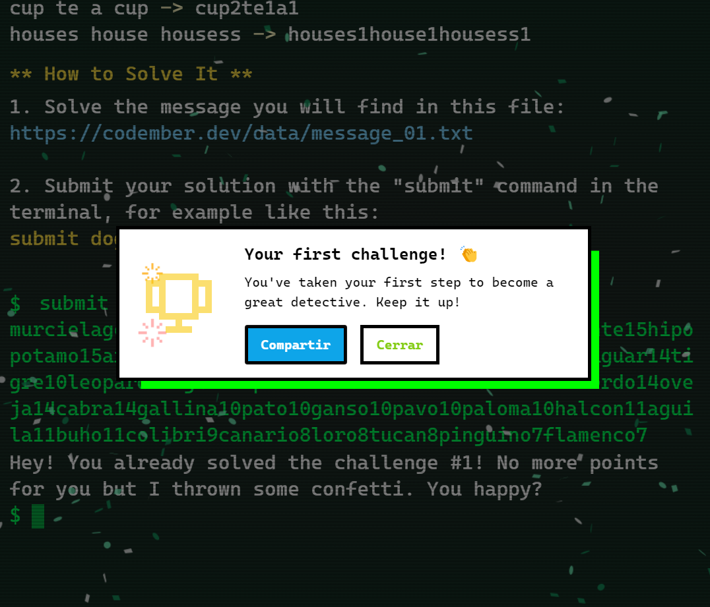

## The Challenge_01

A spy is sending encrypted messages.

Your mission is to create a program that decodes the messages.

The messages are words separated by spaces like this:

***cat dog dog car Cat doG sun***

We need the program to return the number of times each word appears in the message, regardless of whether it is in uppercase or lowercase.

The result will be a text string with the word and the number of times it appears in the message, in this format:

***cat2dog3car1sun1***

The words are sorted by their first appearance in the message!

### More Examples:
keys house HOUSE house keys **->** keys2house3

cup te a cup **->** cup2te1a1

houses house housess **->** houses1house1housess1

### How to Solve It
1. Solve the message you will find in this file: https://codember.dev/data/message_01.txt

2. Submit your solution with the "submit" command in the terminal, for example like this:
``` bash
submit dog3cat3car1sun1
```

### Solution Code:

``` javascript

let message =
  "murcielago leon jirafa cebra elefante rinoceronte hipopotamo ardilla mapache zorro lobo oso puma jaguar tigre leopardo gato perro caballo vaca toro cerdo oveja cabra gallina pato ganso pavo paloma halcon aguila buho colibri canario loro tucan pinguino flamenco tigre jaguar leopardo oso lobo zorro mapache ardilla elefante rinoceronte hipopotamo cebra jirafa leon murcielago cabra oveja cerdo toro vaca caballo perro gato leopardo tigre jaguar oso lobo zorro mapache ardilla hipopotamo rinoceronte elefante jirafa leon murcielago pavo ganso pato gallina cabra oveja cerdo toro vaca caballo perro gato leopardo tigre jaguar oso lobo zorro mapache ardilla hipopotamo rinoceronte elefante jirafa leon murcielago buho aguila halcon paloma pavo ganso pato gallina cabra oveja cerdo toro vaca caballo perro gato leopardo tigre jaguar oso lobo zorro mapache ardilla hipopotamo rinoceronte elefante jirafa leon murcielago colibri buho aguila halcon paloma pavo ganso pato gallina cabra oveja cerdo toro vaca caballo perro gato leopardo tigre jaguar oso lobo zorro mapache ardilla hipopotamo rinoceronte elefante jirafa leon murcielago tucan loro canario colibri buho aguila halcon paloma pavo ganso pato gallina cabra oveja cerdo toro vaca caballo perro gato leopardo tigre jaguar oso lobo zorro mapache ardilla hipopotamo rinoceronte elefante jirafa leon murcielago flamenco pinguino tucan loro canario colibri buho aguila halcon paloma pavo ganso pato gallina cabra oveja cerdo toro vaca caballo perro gato leopardo tigre jaguar oso lobo zorro mapache ardilla hipopotamo rinoceronte elefante jirafa leon murcielago jaguar oso lobo zorro mapache ardilla cebra elefante rinoceronte hipopotamo leon jirafa murcielago caballo vaca toro cerdo oveja cabra gallina pato ganso pavo paloma halcon aguila buho colibri canario loro tucan pinguino flamenco jaguar oso lobo zorro mapache ardilla cebra elefante rinoceronte hipopotamo leon jirafa murcielago caballo vaca toro cerdo oveja cabra gallina pato ganso pavo paloma halcon aguila buho colibri canario loro tucan pinguino flamenco murcielago leon jirafa cebra elefante rinoceronte hipopotamo ardilla mapache zorro lobo oso puma jaguar tigre leopardo gato perro caballo vaca toro cerdo oveja cabra gallina pato ganso pavo paloma halcon aguila buho colibri canario loro tucan pinguino flamenco oso lobo zorro mapache ardilla hipopotamo rinoceronte elefante jirafa leon murcielago cabra oveja cerdo toro vaca caballo perro gato leopardo tigre jaguar oso lobo zorro mapache ardilla cebra elefante rinoceronte hipopotamo jirafa leon murcielago pavo ganso pato gallina cabra oveja cerdo toro vaca caballo perro gato buho aguila halcon paloma colibri canario loro tucan pinguino flamenco jaguar oso lobo zorro mapache ardilla hipopotamo rinoceronte elefante jirafa leon murcielago cabra oveja cerdo toro vaca caballo perro gato buho aguila halcon paloma colibri canario loro tucan pinguino flamenco jaguar oso lobo zorro mapache ardilla hipopotamo rinoceronte elefante jirafa leon murcielago cabra oveja cerdo toro vaca caballo perro gato buho aguila halcon";

let messageArr = message.toLowerCase().split(" ");
let result = [];

const wordCount = messageArr.reduce((counter, word) => {
  counter[word] = (counter[word] || 0) + 1;
  return counter;
}, []);

Object.keys(wordCount).forEach((key) => {
  result.push(key + wordCount[key]);
});

console.log(result.join(""));


```
### Solution output

``` javascript
murcielago15leon15jirafa15cebra6elefante15rinoceronte15hipopotamo15ardilla15mapache15zorro15lobo15oso15puma2jaguar14tigre10leopardo10gato12perro12caballo14vaca14toro14cerdo14oveja14cabra14gallina10pato10ganso10pavo10paloma10halcon11aguila11buho11colibri9canario8loro8tucan8pinguino7flamenco7
```
